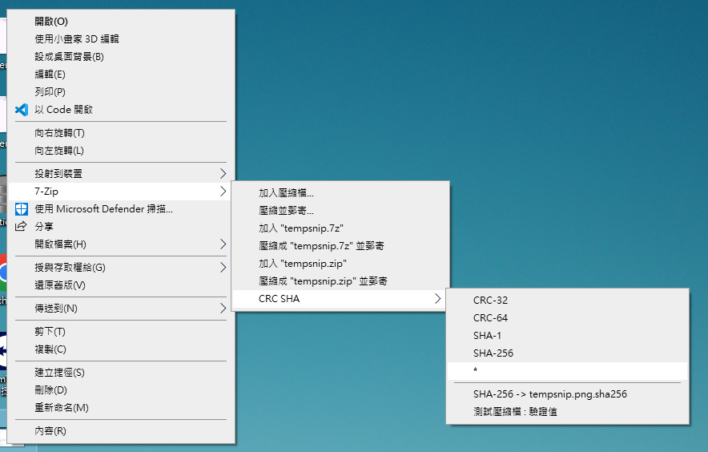

+++
date = '2024-07-29T09:12:00+08:00'
draft = false
title = '如何查看檔案雜湊值 (MD5、SHA256、SHA1)'
tags = ['hash']
+++

## Windows

### 使用命令提示字元 CMD

1. 開啟檔案所在位置。
2. 於視窗上方網址列輸入 `cmd` 開啟命令提示字元。
3. 輸入指令`certutil -hashfile {你的檔案名稱} {演算法}`。
4. ENTER 執行後就會出現該檔案的雜湊值。

#### MD5

```
certutil -hashfile myfile.txt MD5

// MD5 hash of v1.5.4-20211130-debug.apk:
// c90323574f66283d6b146f2d98d477c4
// CertUtil: -hashfile command completed successfully.
```

#### SHA-1

```
certutil -hashfile myfile.txt SHA1
```

### 使用 7-Zip 查看



1. 右鍵點選檔案開啟選單
2. 選擇 7-Zip / CRC SHA
3. 選擇所需要的演算法。(如果點選 `*` 號，則會算出 7-Zip 支援的所有演算雜湊值。)

## Mac

1. 開啟 Terminal
2. 根據演算法選擇指令
    - `md5 檔案路徑`
    - `shasum -a 1 檔案路徑`
    - `shasum -a 256 檔案路徑`

## 參考資料

- [How to Check an MD5 Checksum on desktop/laptop (PC/MAC)](https://portal.nutanix.com/page/documents/kbs/details?targetId=kA07V000000LWYqSAO)
- [Mac OSX 如何在命令行中生成 md5、sha1、sha256 校验](https://www.cnblogs.com/craftsman-gao/p/7601756.html)

---

本文同步發表在 [HackMD](https://hackmd.io/@dh46tw/file-hash-check)。  
